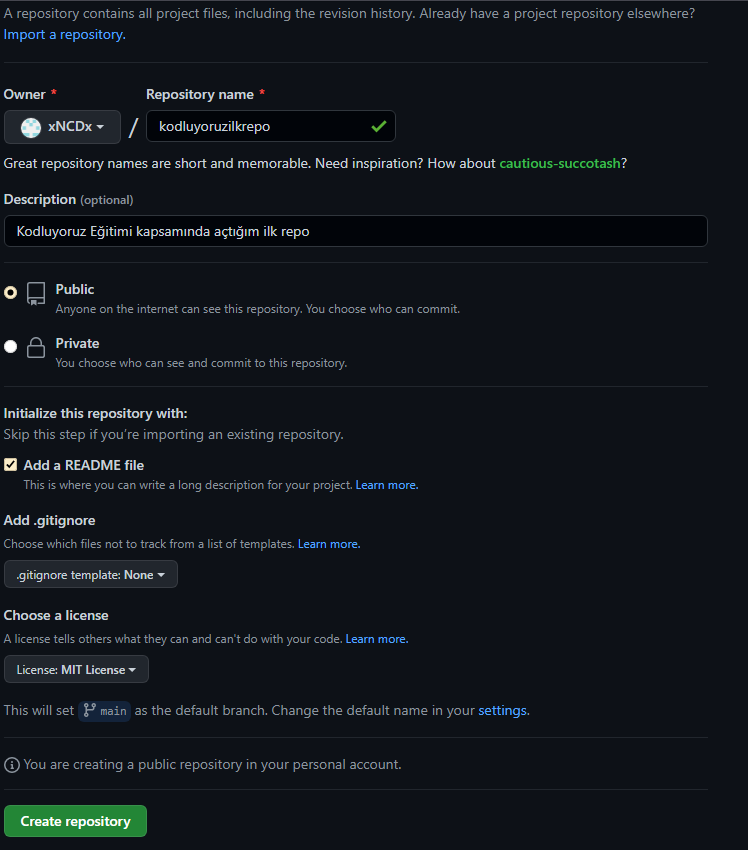

# Kodluyoruz İlk Repo
---
Bu repo, [Kodluyoruz](www.kodluyoruz.org) Front-End Eğitiminde oluşturduğumuz ilk repo. İçerisinde bir adet README dosyası, bir adet de index.html barındırıyor.



# Installation

Öncelikle projeyi clonelayın. (Buraya sizin reponuzdan aldığınız link gelecek.)


```
git clone https://github.com/xNCDx/kodluyoruzilkrepo.git
``` 
---
# Usage
Projeyi kolnladıktan sonra Visual Studio Code programı/cmd açtık.

```
Linux için:
cd kodluyoruzilkrepo
code.
``` 

---
# Contributing

Pull requestler kabul edilir. Büyük değişiklikler için, lütfen önce neyi değiştirmek istediğinizi tartışmak için bir konu açınız.

---

# License

[MIT](https://choosealicense.com/licenses/mit/)
